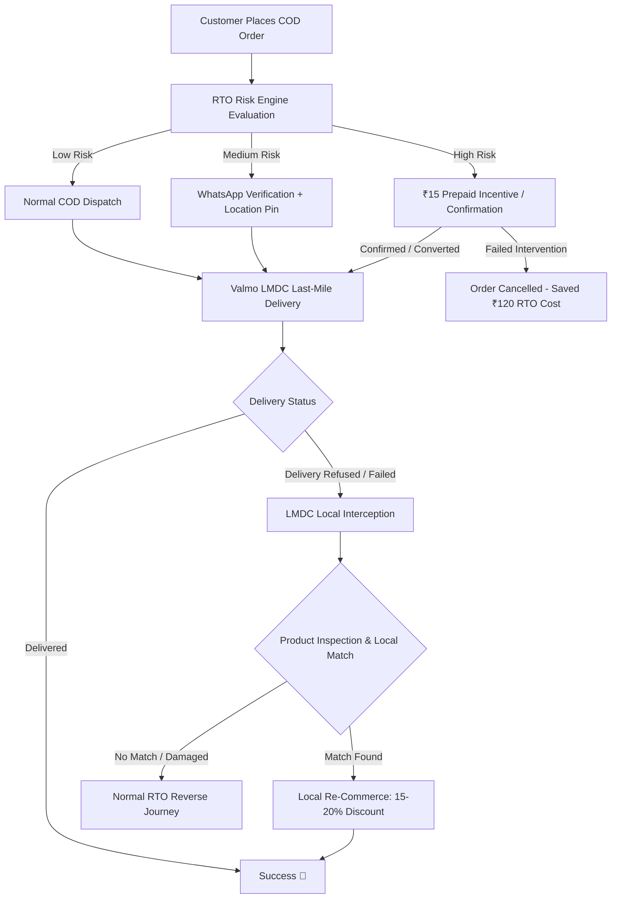

# Meesho DICE Challenge Season 3 — Valmo Track (Round 1) 🚀
## *Reducing RTO: Getting More Orders Delivered*

[](https://www.meesho.com)
[_Dhanbad-blue?style=for-the-badge)](https://www.iitism.ac.in)
[](#team-members)
[](LICENSE)

---

## 📌 Executive Summary

Return-to-Origin (RTO) is one of the most critical unit-economic challenges facing Tier 2+ e-commerce in India. In Meesho's Cash on Delivery (COD) dominated ecosystem (80%+ COD orders), RTO introduces a **2.4× cost asymmetry**—where an RTO shipment costs **₹120** compared to **₹50** for a successful delivery, severely impacting margins and seller retention.

This repository presents **Team PotentiallyBald's Round 1 submission** for the **Meesho DICE Challenge Season 3 (Valmo Track)**. Our framework transforms RTO from an unmanaged operational cost into a controllable, optimized operational metric using a two-tier solution:
1. **Preventive Layer**: AI-driven RTO Risk Engine + Pre-Dispatch Interventions.
2. **Recovery Layer**: Decentralized Last-Mile Delivery Center (LMDC) Interception + Local Re-commerce.

---

## 🎯 Problem Statement & Market Reality

### The Core Asymmetry
- **COD Dominance**: ~80% of all orders are Cash-on-Delivery. **94% of total RTOs originate from COD orders**.
- **Financial Drag**: Delivering an order costs ~₹50; returning an RTO shipment costs ~₹120 due to reverse line-haul, hub sorting, and merchant restocking.
- **Distance Penalty**: Deliveries located >10 km from the destination LMDC suffer an RTO rate of up to **22%**.
- **Incentive Misalignment**: Delivery partners earn low per-delivery payouts (~₹21/delivery), leading to potential fake delivery attempts on high-effort/remote routes.

---

## 💡 Strategic Framework & Proposed Solutions



### 🛡️ Model 1: Preventive Layer — Real-Time RTO Risk Engine & Pre-Dispatch Intervention
* **Predictive Scoring**: Evaluates customer history, order value, geo-spatial address accuracy, and delivery signals at the moment of order placement.
* **Tiered Interventions**:
  * **Low Risk**: Smooth, friction-free COD journey.
  * **Medium Risk**: Automated WhatsApp interactive confirmation & precise live-location pin collection.
  * **High Risk**: Dynamic ₹15 prepaid discount incentive (converting COD to prepaid) or mandatory order confirmation.
* **Unit Economics**: Triggers a ₹15 incentive only when the expected RTO loss exceeds the intervention cost, preserving COD access while curbing high-risk returns.

### 🔄 Model 2: Recovery Layer — LMDC Interception & Local Re-Commerce
* **Local Inventory Conversion**: When a customer refuses delivery, the product stays at the destination Valmo LMDC node instead of entering reverse line-haul transport.
* **Quality & Demand Match**: Undergoes immediate quality check and gets listed on Meesho’s local re-commerce layer with a targeted 15–20% discount for nearby buyers.
* **Economic Benefit**: Replaces a expensive ₹120 reverse journey with a local re-delivery, recovering inventory value and protecting seller margins.

---

## 👥 Delivery Stakeholder Personas

| Stakeholder Persona | Key Pain Points | Opportunity via Proposal |
| :--- | :--- | :--- |
| **Last-Mile Rider** (Valmo Partner) | Long distance routes, unstructured addresses, low payout (~₹21/delivery) | GPS proof of attempt, route optimization, tiered difficulty payouts |
| **COD Customer** | Buyer remorse, cash unavailability, 3–5 day delivery wait | WhatsApp confirmation, location pin sharing, prepaid conversion discount |
| **LMDC Hub Operator** | Address ambiguity, high failed attempt volume, space clutter | Real-time RTO heatmaps, rider analytics, local re-commerce inventory matching |
| **Merchant / Seller** | ₹120 RTO penalty per return, inventory tied up, product damage | Local RTO interception, faster stock turnaround, enhanced tracking |

---

## 📊 Key Operational Metrics (KPIs)

* **Preventive Layer**: COD-to-Prepaid Conversion Rate, First-Attempt Delivery Rate (FADR), Net RTO Cost Avoided, Intervention Conversion %.
* **Recovery Layer**: Intercepted RTO %, Local Re-commerce Conversion %, Reverse Cost Saved, Net Recovery Value / RTO.

---

## 📁 Repository Structure

```
├── PotentiallyBald_IIT Dhanbad.pptx    # Round 1 Presentation Deck (PPTX format)
├── PotentiallyBald_IIT Dhanbad.pdf     # Round 1 Presentation Deck (PDF format)
├── Resources/                          # Official Meesho DICE Challenge Case Studies & Templates
│   ├── DICE Challenge S3  Valmo Case studies.pdf
│   ├── DICE Challenge S3  CC Case studies.pdf
│   ├── DICE Challenge S3  Monetization Case studies.pdf
│   ├── DICE Challenge S3  Pricing Case studies.pdf
│   ├── DICE Challenge S3  SG Case studies.pdf
│   ├── DICE Challenge S3  UG Case studies.pdf
│   └── DICE Challenge S3  Template for Case studies submission  (Presentation).pptx
├── References/                         # Reference decks and benchmark research papers
│   ├── Team Synergy_IIT Dhanbad.pdf
│   └── ...
├── LICENSE                             # Open-source MIT License
└── README.md                           # Comprehensive project documentation
```

---

## 👥 Team Members — Team PotentiallyBald

* **Saket Kumar Singh** — IIT (ISM) Dhanbad
* **Mayank Raj** — IIT (ISM) Dhanbad
* **Sahil Bhavesh Choudhary** — IIT (ISM) Dhanbad

---

## 📜 License

This repository is licensed under the [MIT License](LICENSE).
